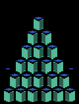

# SAC-discrete


# Paper: 

Soft Actor-Critic: Off-Policy Maximum Entropy Deep Reinforcement Learning with a Stochastic Actor, Haarnoja et al, 2018 https://arxiv.org/abs/1801.01290

# Recorded gif:



# Dependencies:
```
tensorflow 1.15.0
gym[atari] 0.15.7
cv2
mpi4py
numpy
matplotlib
```

# Usage
```
# install environment from .yml
conda env create -f env.yml

# source env
conda activate sac

# install some packages from pip
pip install -r req.txt

# install Spinningup from openAI
git clone https://github.com/openai/spinningup.git
cd spinningup
pip install -e .
cd ..
```


# To train a model:

```
#train with GPU
python ./image_observation/sac_discrete_atari/sac.py --env 'Breakout' --use_gpu --gpu 1 --seed 3

#train with CPU
python ./image_observation/sac_discrete_atari/sac.py --env 'Breakout' --seed 3

```
After training the model will be saved in dir ./saved_models/

# To plot the training curve:
```
python ./plot_progress.py  --env BeamRider --seed 3
```
The same seed for training should be given.

# To reload the trained model:
```python
from Utils.model_loader import model_loader

# where is the trained model
model_dir = 'saved_models/sac_discrete_atari_BeamRider-v4/sac_discrete_atari_BeamRider-v4_s3/'
model_save_name = 'tf1_save5'

# load the model
model = model_loader(model_dir, model_save_name)

# to get the optimal action given current state
model.get_action(obs, deterministic=True)

# to get the sampled action given current state
model.get_action(obs, deterministic=False)

# to get the probability of next action given current state
model.get_action_probabilistic(obs)

# to get the log probability of next action given current state
model.get_action_log_probabilistic(obs)

# Others:
   # to get the settings for the model
model.config
model.max_ep_len
```

# To create env for the model:

```python
from Utils.envGym import envGym
import gym

# create a env from gym
original_env = gym.make(model.config['rl_params']['env_name'])

# wrap it using our env class
env = envGym(original_env, 4)

# to reset the env
obs = env.reset()

# to render the env (same as Gym.env)
env.render()

# to step an action
obs, rew, done, info = env.step(action)

# to close the env
env.close()

# Others:
   # to get the settings of the env
env.action_space
env.observation_space
env.reward_range
env.metadata
# just treat the envGym Class as the same as Gym.env
```
        

# An example for reloading:
```
python ./load_atari_model.py  --env BeamRider --model_id 24 --seed 3
```

After the command is executed, the program will run the atari game 5 times and calculate the mean of cumulated reward and clipped reward (+1 for positive reward, -1 for negative reward, 0 for no reward).

See the source code for details.

# To record a gif:
```
python ./record_a_gif.py  --env BeamRider --model_id 24 --seed 3 --max_len 10000 --num 5
```
The created gifs will be saved to ./saved_gifs folder

# Notice:
SAC-discrete works well for some Atari game Space Invaders, Qbert, Breakout, BeamRider, but performs terrible for Pong, Freeway; other environments are testing...

|  Works well  | Not bad| Doesn't work |
|  ----:  | ----: | ----:|
| Assault      | Breakout      |Pong | 
|  BeamRider   | SpaceInvaders   |Seaquest | 
| Enduro| Qbert        |Battlezone |
|        | |Berzerk    |
|              | |Asterix    |

Main results:
|  env  |model_id| seed| Deterministic?| avg_reward(return)| avg_ep_length|
|  ----:  |  ----:| ----:|----:|----: | ----:
| Assault      |20| 6   | False |   820.8 (+39.2)|  1038.4
|  Enduro      |12| 3   | True  |   322.1 (+402.2)| 7098.8
|  BeamRider   |24| 3   | False |   1636.8 (+34.9)|  2052.9
| SpaceInvaders|20| 6   | False |   363.0 (+23.6) |   891.7
| Breakout     |6 | 6   | True  |   24.8 (+18.8)  |   988.1
|  Qbert       |24| 6   | True  |   850.0 (+22.9) |   600.8    


# One more thing
Due to the limit of Github to share large files, please download the saved_models folder via Google drive:
https://drive.google.com/drive/folders/1g0y0XKrMw5hUUfcuH5fyeaGHWTUuwxU_?usp=sharing

# To calculate the avg entropy of action probability
```
python ./get_evg_entropy.py
```
The results:
```
mean Entropy for Qbert-v4 0.5283024787481685
mean Entropy for Assault-v4 0.5265025734385411
mean Entropy for Enduro-v4 0.2922887822680233
mean Entropy for BeamRider-v4 0.4767544871332122
mean Entropy for SpaceInvaders-v4 0.6042465290228025
mean Entropy for Breakout-v4 0.6128823243743766
```